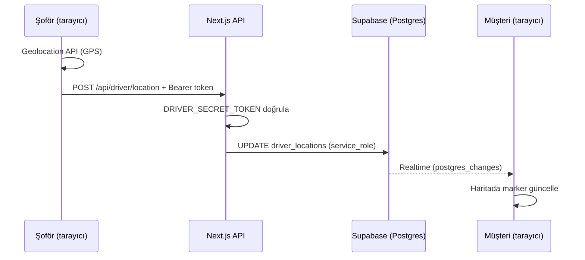

# Citytaxi Horw — Canlı Takip Sistemi

Bu belge, müşterinin taksiyi haritada canlı görmesi ve şoförün konum paylaşması akışını uçtan uca açıklar.

---

## 1. Özet

| Rol | Ne yapar? | Sayfa / adres |
|-----|-----------|----------------|
| **Şoför** | GPS konumunu sunucuya gönderir (yaklaşık 5 saniyede bir) | `https://citytaxihorw.ch/fahrer` |
| **Müşteri** | Supabase Realtime ile güncellenen konumu haritada görür | `https://citytaxihorw.ch/takip` |
| **Sunucu** | Şoför token’ını doğrular, Supabase’e yazar | `POST /api/driver/location`, `DELETE /api/driver/location` |
| **Veritabanı** | Tek araç satırı: `driver_id = citytaxi-horw-1` | Supabase tablosu `driver_locations` |

Tek araçlı işletme için tasarlanmıştır: veritabanında **bir** sürücü satırı vardır; tüm güncellemeler bu satıra yazılır.

---

## 2. Veri akışı (yüksek seviye)

- Şoför **doğrudan** Supabase’e yazamaz; yazma işlemi yalnızca **service role** anahtarı ile API route üzerinden yapılır.
- Müşteri **anon** anahtar ile tabloyu **okuyabilir** ve Realtime aboneliği alır.

---

## 3. Veritabanı şeması

Dosya: `supabase/migrations/20260407000000_create_driver_locations.sql`

| Sütun | Açıklama |
|-------|----------|
| `driver_id` | Benzersiz kimlik; kodda sabit: `citytaxi-horw-1` |
| `lat`, `lng` | Enlem / boylam |
| `is_active` | `true` = şoför “fahrt” modunda, müşteri haritada görür |
| `heading`, `speed` | İsteğe bağlı (cihaz verirse) |
| `updated_at` | Son güncelleme zamanı |

**Row Level Security (RLS):**

- **SELECT:** Herkese açık (müşteri haritayı okuyabilsin diye).
- **INSERT/UPDATE/DELETE:** Yalnızca `service_role` (API route içinde kullanılan `SUPABASE_SERVICE_KEY`).

**Realtime:** `driver_locations` tablosu `supabase_realtime` yayınına eklenir; satır güncellenince abone olan istemciler anında bilgi alır.

---

## 4. Ortam değişkenleri

Production ve local için `.env.local` (veya hosting panelindeki env) içinde tanımlanmalıdır:

| Değişken | Kim görür? | Açıklama |
|----------|------------|----------|
| `NEXT_PUBLIC_SUPABASE_URL` | İstemci + sunucu | Supabase proje URL’si |
| `NEXT_PUBLIC_SUPABASE_ANON_KEY` | İstemci + sunucu | Müşteri sayfası (`/takip`) ve genel okuma |
| `SUPABASE_SERVICE_KEY` | **Sadece sunucu** | Asla tarayıcıya gömülmez; API route yazma için |
| `DRIVER_SECRET_TOKEN` | **Sadece sunucu** | Şoför isteğinin yetkilendirilmesi |

`SUPABASE_SERVICE_KEY` ve `DRIVER_SECRET_TOKEN` **commit edilmemeli**, sadece güvenli ortam değişkenlerinde tutulmalıdır.

---

## 5. Şoför tarafı (`/fahrer`)

### 5.1 Neden token her sefer girilmiyor?

Şoförler uzun bir “secret” yazmak zorunda değil:

1. **İlk kurulum:** Ofis, şoföre **tek seferlik** tam linki gönderir:  
   `https://citytaxihorw.ch/fahrer?t=<DRIVER_SECRET_TOKEN>`
2. Sayfa açılınca `t=` parametresindeki değer **tarayıcıda `localStorage`** içine kaydedilir; adres çubuğundaki token temizlenir (`/fahrer`).
3. Sonraki ziyaretlerde token tekrar sorulmaz; şoför yalnızca büyük **START** / **STOP** butonlarını kullanır.

Token’ı bilen biri teorik olarak konum gönderebilir; bu nedenle link **yalnızca güvenilir şoförlere** verilmeli, gerektiğinde `DRIVER_SECRET_TOKEN` değiştirilip yeni link dağıtılmalıdır.

### 5.2 START sonrası ne olur?

- Tarayıcı **Geolocation API** ile konum alır.
- Yaklaşık **5 saniyede bir** `POST /api/driver/location` çağrılır; gövdede `lat`, `lng`, isteğe bağlı `heading`, `speed`, `is_active: true`.
- Başarılı olunca Supabase satırı güncellenir; `is_active` true kalır.

### 5.3 STOP

- Periyodik gönderim durur.
- `DELETE /api/driver/location` ile sunucu `is_active: false` yazar; müşteri tarafında “offline” durumu gösterilebilir.

### 5.4 Teknik notlar

- iOS Safari’de konum için **HTTPS** gerekir.
- Sayfa açık kalmalıdır; arka planda sürekli GPS web’de güvenilir çalışmaz.

---

## 6. API route (`/api/driver/location`)

Dosya: `src/app/api/driver/location/route.ts`

| Metot | Görev |
|-------|--------|
| `POST` | `Authorization: Bearer <DRIVER_SECRET_TOKEN>` doğrula → `driver_locations` satırını güncelle |
| `DELETE` | Aynı token ile `is_active = false` |

`driver_id` kod içinde sabittir: `citytaxi-horw-1`. İleride birden fazla araç için bu yapı genişletilebilir.

---

## 7. Müşteri tarafı (`/takip`)

Dosya: `src/app/takip/page.tsx`

- `@supabase/supabase-js` ile `driver_locations` tablosundan `driver_id = citytaxi-horw-1` satırı okunur.
- **Realtime kanalı** ile `UPDATE` olayları dinlenir; konum değişince haritadaki marker güncellenir.
- Harita: Google Maps JS API, projede mevcut `loadMapsScript` ile yüklenir (`NEXT_PUBLIC_GOOGLE_MAPS_API_KEY`).
- `is_active === false` ise genelde “şoför offline” mesajı gösterilir.

---

## 8. Rezervasyon e-postası

Müşteri onay e-postasında **“Taxi jetzt verfolgen”** benzeri bir CTA ile `https://citytaxihorw.ch/takip` adresine yönlendirme vardır (şablon: `src/lib/booking-notifications.ts`).

---

## 9. Supabase CLI ile dağıtım

Projede `supabase link` ve `supabase db push` ile migration’lar uzak veritabanına uygulanabilir. Yerel `supabase db diff` gibi komutlar **Docker Desktop** gerektirebilir.

Yeni kurulumda migration dosyası SQL Editor’de de çalıştırılabilir.

---

## 10. Sorun giderme

| Belirti | Olası neden |
|---------|-------------|
| Müşteri haritada hiç güncelleme görmüyor | Realtime yayınında tablo yok; RLS veya proje ayarı |
| Şoför 401 alıyor | `DRIVER_SECRET_TOKEN` uyuşmuyor veya env production’da eksik |
| Şoför kaydediyor, müşteri görmüyor | `SUPABASE_SERVICE_KEY` yanlış; veya `driver_id` eşleşmiyor |
| Harita boş | Google Maps API anahtarı / referrer kısıtı |
| `/fahrer` “Kein Zugang” | `?t=` ile hiç açılmamış veya `localStorage` silinmiş |

---

## 11. İlgili dosyalar (referans)

| Dosya | Amaç |
|-------|------|
| `src/app/fahrer/page.tsx` | Şoför arayüzü |
| `src/app/takip/page.tsx` | Müşteri harita + Realtime |
| `src/app/api/driver/location/route.ts` | Konum yazma / offline |
| `src/lib/supabase.ts` | Tarayıcı Supabase istemcisi |
| `src/lib/maps-loader.ts` | Google Maps script (ortak) |
| `supabase/migrations/20260407000000_create_driver_locations.sql` | Şema + RLS + Realtime + seed |

---

*Son güncelleme: proje içi canlı takip mimarisiyle uyumlu olarak yazılmıştır.*
